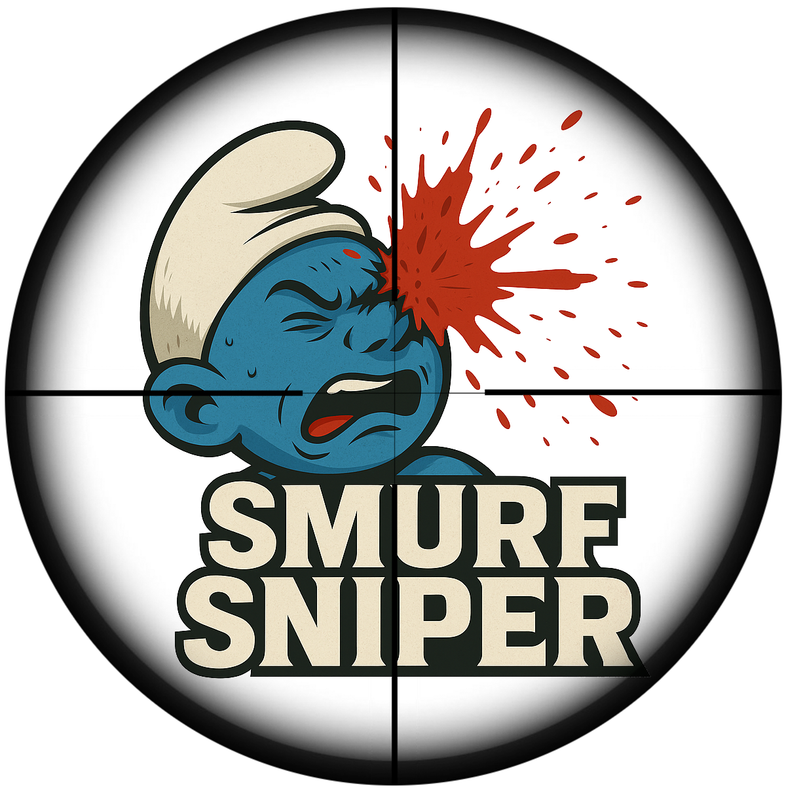

# SmurfSniper 🎯

**SmurfSniper** is a StarCraft II overlay and analysis tool that watches your matches in real time and quietly judges everyone involved. Using match history, MMR trends, and statistical variance, it identifies suspicious opponents who look a little too good for their stated rank.

<p align="center">
  
</p>

---

## Features

- Real-time player overlays for 1v1, 2v2, and team games  
- MMR trend and volatility analysis  
- Smurf likelihood scoring based on historical performance  
- Persistent player logs across matches  
- Fully configurable overlays (position, orientation, duration, delay)  
- Lightweight, non-blocking UI rendering  

---

## Requirements

- Python 3.13 or newer  
- StarCraft II (running locally)  
- Windows (overlay support is Windows-first)  
- Internet access for player stat lookups  

---

## Installation

### Clone the repository

```bash
git clone https://github.com/JaminB/smurfsniper.git
cd smurfsniper
```

### Create a virtual environment

```bash
python -m venv .venv
```

Activate it:

**Windows**
```bash
.venv\Scripts\activate
```

**macOS / Linux**
```bash
source .venv/bin/activate
```

### Install dependencies
From inside the top-level directory run

```bash
pip install .
```

---

## Configuration

SmurfSniper is configured via a YAML file. By default, it looks for `config.yml` in the project root.

### Example `config.yml`

```yaml
me:
  name: YourBattleTag
  mmr: 4200

team:
  name: Ladder Gremlins
  mmr: 4100
  members:
    - TeammateOne
    - TeammateTwo

1v1_overlay:
  visible: true
  orientation: horizontal
  position: top_center
  seconds_delay_before_show: 0.0
  seconds_visible: 30

2v2_overlay:
  visible: true
  orientation: horizontal
  position: top_center
  seconds_delay_before_show: 2.0
  seconds_visible: 40

team_overlay:
  visible: true
  orientation: vertical
  position: top_right
  seconds_delay_before_show: 3.0
  seconds_visible: 45

player_log_1:
  visible: true
  orientation: vertical
  position: bottom_left
  seconds_delay_before_show: 0.0
  seconds_visible: 60

player_log_2:
  visible: false
```

---

## Usage

```bash
smurfsniper.exe run --config config.yaml
```

---

## License

MIT License.